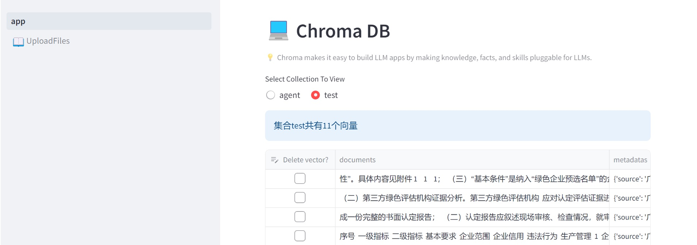
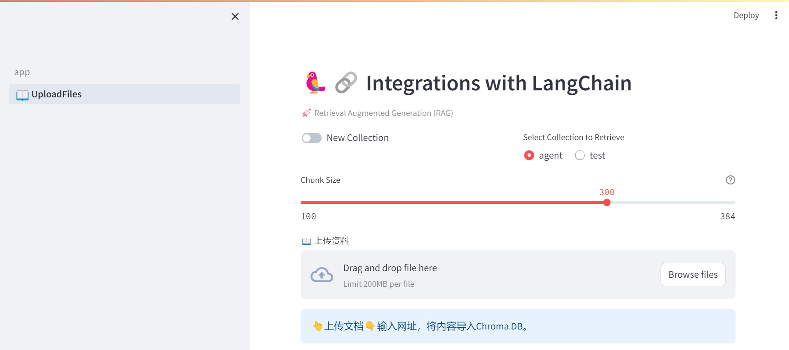

# Chroma-DB-UI
Add a simple UI for Chroma database with Streamlit.  

- [Chroma](https://www.trychroma.com/) is the open-source embedding database.
- [Streamlit](https://streamlit.io/) is an open-source app framework for Machine Learning and Data Science teams.

向量数据库增删改查：

上传文件：

